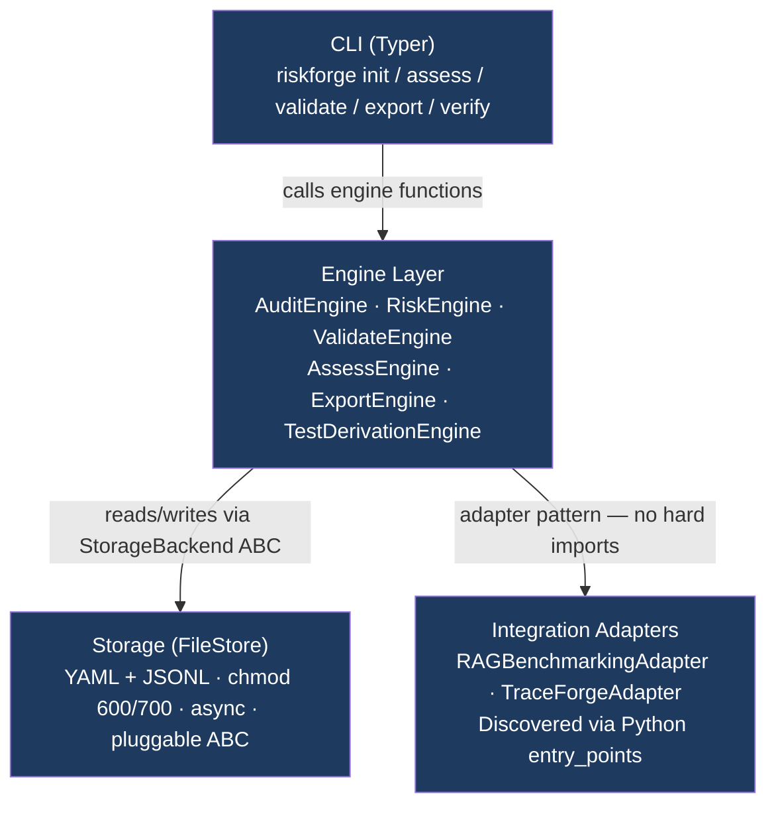
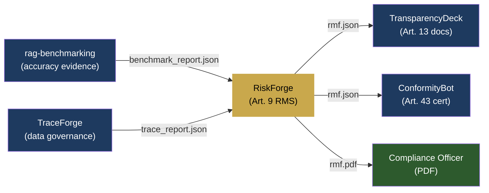
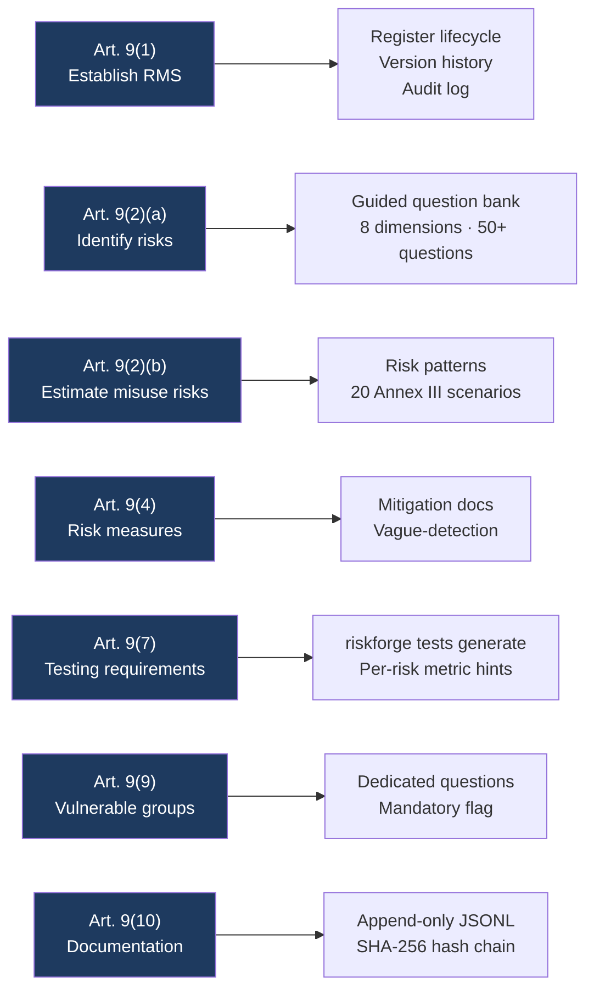

# RiskForge

[](https://pypi.org/project/riskforge/)
[](https://github.com/aiexponenthq/riskforge/actions)
[](LICENSE)
[](https://www.python.org/downloads/)
[](#privacy)

**RiskForge** is an open-source CLI that turns EU AI Act Article 9 compliance from a consultant invoice into a 30-minute developer workflow.

Answer 50+ guided questions about your AI system. RiskForge produces a SHA-256-signed Risk Management File (JSON + PDF) that satisfies Annex IV documentation requirements — ready for your legal team and your downstream compliance toolchain.

Built by [AiExponent LLC](https://aiexponent.com). Apache 2.0. Runs entirely offline after `pip install`.

---

## Quick Start

```bash
pip install riskforge
```

```bash
# 1. Register your AI system
riskforge init \
  --name "Loan Scoring Model" \
  --sys-version "2.1" \
  --purpose "Automated credit scoring for retail loan applications." \
  --provider "Acme Financial Services" \
  --category essential_services
```

```bash
# 2. Run the guided 8-dimension risk assessment (~25 minutes)
riskforge assess <system-id> \
  --assessor-name "Alice Chen" \
  --assessor-role "AI Governance Lead"
```

```bash
# 3. Check completeness before export
riskforge validate <system-id>

# 4. Export your Article 9 Risk Management File
riskforge export <system-id> --format pdf --output rmf.pdf
riskforge export <system-id> --format json --output rmf.json
```

---

## Why RiskForge

EU AI Act Article 9 requires providers of **high-risk AI systems** to maintain a documented risk management system throughout the system's lifecycle.

The current alternatives:

| Option | Cost | Time | Repeatable |
|---|---|---|---|
| Big 4 consulting | €80K–€350K per system | Weeks | No |
| Enterprise GRC platforms | $60K–$200K/year | Months | Partial |
| Spreadsheets | Free | Days | No |
| **RiskForge** | **Free** | **~30 min** | **Yes** |

---

## Architecture

RiskForge has four strictly-decoupled layers with CI-enforced import boundaries:



**State on disk:**

```
your-project/
├── riskforge.yaml              ← project manifest
├── .riskforge/
│   ├── audit.jsonl             ← append-only hash-chained audit log
│   └── .nodelete               ← deletion sentinel
└── systems/<system-id>/
    ├── system.yaml
    ├── register.yaml
    └── exports/
        └── rmf-*.json
```

Plain YAML + JSONL — readable by regulators without RiskForge installed, diff-able in GitHub PRs.

---

## AiExponent Compliance Toolchain

RiskForge is the structural centre of the AiExponent compound moat. Every upstream tool feeds it; every downstream tool consumes it.



All connections are file-based. RiskForge never calls external APIs.

---

## EU AI Act Article 9 Coverage



Cross-maps to: **NIST AI RMF** (GOVERN/MAP/MEASURE/MANAGE) · **ISO/IEC 42001** (Clauses 6.1, 8.4, A.6–A.9) · **Colorado AI Act SB 24-205** · **Texas HB 1709**

> **Disclaimer:** RiskForge produces documented evidence for Article 9 compliance. It does not substitute for qualified legal counsel or notified body conformity assessment.

---

## Validation Gates

Before every export, `riskforge validate` runs 8 gates:

| Gate | Check |
|---|---|
| G1 | All 8 risk dimensions have at least one entry |
| G2 | Article 6(2) Annex III self-classification documented |
| G3 | All high-scoring risks mitigated or accepted with rationale |
| G4 | Knowledge gaps have test requirements |
| G5 | System metadata complete |
| G6 | Assessor identity recorded |
| G7 | Risk score distribution plausible (warns if all scores are low) |
| G8 | No vague mitigation language detected |

---

## Features

| Feature | Detail |
|---|---|
| **Offline-first** | Zero outbound calls after `pip install` — enforced by `pytest-socket` CI gate |
| **Hash-chained audit** | Every mutation appended to `audit.jsonl`; `riskforge verify` exits code 2 on tampering |
| **Schema-validated exports** | Every JSON export validated against `rmf.schema.json` before writing |
| **PDF export** | WeasyPrint + Jinja2 — no LibreOffice or `wkhtmltopdf` required |
| **Pattern matching** | 20 pre-built risk patterns for Annex III use cases (credit scoring, hiring, facial recognition…) |
| **Plugin extensible** | Add question banks, exporters, adapters via `pip install` — no config edit required |
| **Git-friendly state** | YAML + JSONL files — human-readable, diff-able, merge-conflict-resolvable |

---

## Contributing

**The easiest contribution requires zero Python** — edit a YAML file and open a PR.

**Add a question** to an existing dimension:

```yaml
# src/riskforge/_data/question_bank/privacy.yaml
- id: PRIV-007
  text: "Does the system process special category data under GDPR Article 9?"
  guidance: "Special category data includes health, biometric, racial, or political data."
  annex_iii_categories: [essential_services, employment]
  default_likelihood_hint: 3
  default_severity_hint: 5
  article_refs: ["Art.9(2)(a)", "Art.10(3)"]
  nist_rmf_ref: "MAP 1.5"
  iso42001_ref: "Clause A.7"
  regulatory_status: settled
```

**Add a risk pattern** — edit `src/riskforge/_data/patterns/patterns.yaml`.

**Fix a bug or add a feature** — see [CONTRIBUTING.md](CONTRIBUTING.md).

```bash
git clone https://github.com/aiexponenthq/riskforge
cd riskforge
make dev-setup   # pip install -e ".[dev]" + pre-commit install
make test        # 57 tests, all must pass
make lint        # ruff check + format
```

---

## Privacy

RiskForge makes **zero outbound network connections** in CLI mode, enforced in CI with `pytest-socket --disable-socket`.

```
RiskForge v0.1.4 | Apache 2.0 | Zero telemetry | aiexponent.com
```

Your AI system's risk data never leaves your machine unless you explicitly deploy the optional API server (`pip install riskforge[server]`).

---

## Releases

| Version | Highlights |
|---|---|
| [v0.1.4](https://github.com/aiexponenthq/riskforge/releases/tag/v0.1.4) | CI fixes: lint version compat, format alignment, --sys-version rename |
| [v0.1.2](https://github.com/aiexponenthq/riskforge/releases/tag/v0.1.2) | OSS hardening: LICENSE, CONTRIBUTING, SECURITY, issue templates, full integration tests |
| [v0.1.1](https://github.com/aiexponenthq/riskforge/releases/tag/v0.1.1) | `riskforge assess` fully implemented; PDF exporter fix; audit chain integrity fixes |
| [v0.1.0](https://github.com/aiexponenthq/riskforge/releases/tag/v0.1.0) | Initial release |

---

## License

[Apache 2.0](LICENSE) — free to use, modify, and distribute.

Built by [AiExponent LLC](https://aiexponent.com) — `hello@aiexponent.com`

---

*Part of the AiExponent open-source AI governance toolchain:
[license-compliance-checker](https://github.com/aiexponenthq/license-compliance-checker) ·
[rag-benchmarking](https://github.com/aiexponenthq/rag-benchmarking) ·
**RiskForge***
