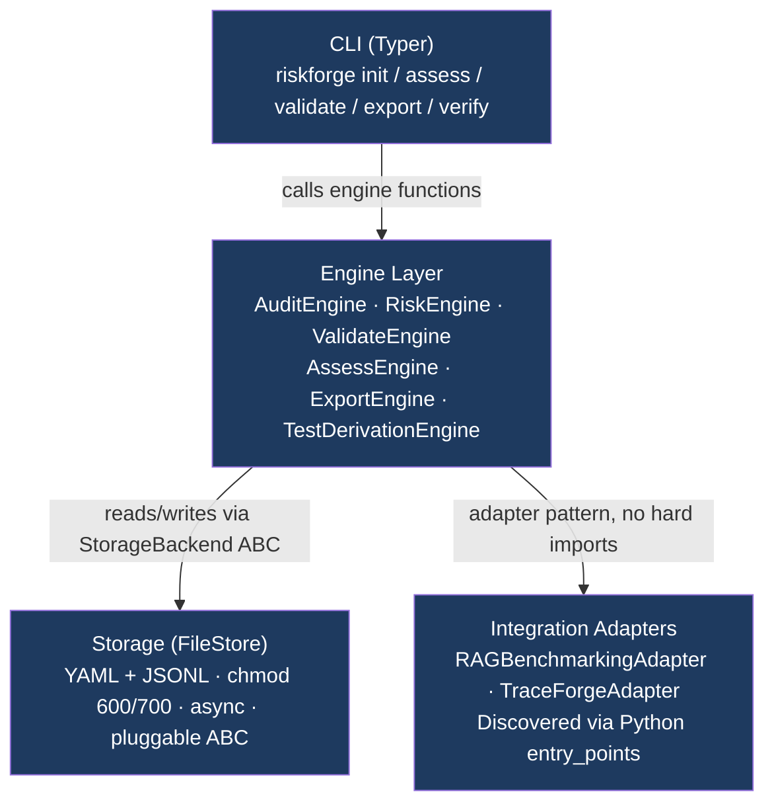
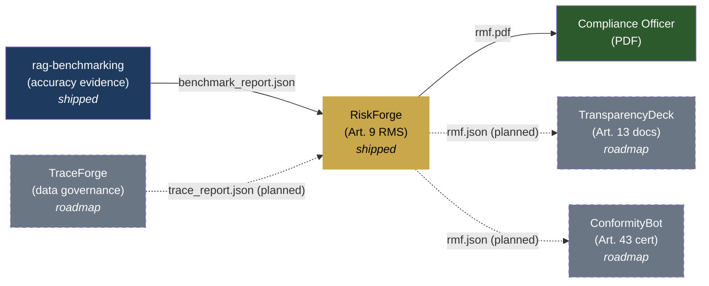
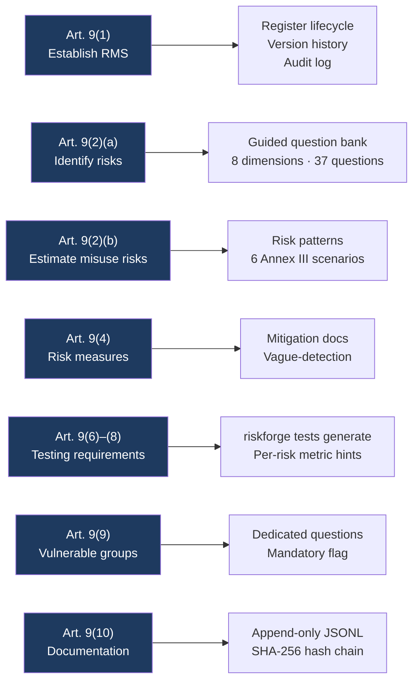

<p align="center">
  <a href="https://aiexponent.com"></a>
</p>

<h1 align="center">RiskForge</h1>
<p align="center"><em>EU AI Act Article 9 risk management, as a developer workflow.</em></p>

<p align="center">
  <a href="https://pypi.org/project/riskforge/"></a>
  <a href="https://github.com/aiexponenthq/riskforge/actions"></a>
  <a href="LICENSE"></a>
  <a href="https://www.python.org/downloads/"></a>
  <a href="https://eur-lex.europa.eu/legal-content/EN/TXT/?uri=CELEX:32024R1689"></a>
  <a href="#privacy"></a>
</p>

---

**RiskForge** is an open-source CLI that turns EU AI Act Article 9 compliance from a consultant invoice into a 30-minute developer workflow.

Answer 37 guided questions across 8 EU AI Act risk dimensions. RiskForge produces a tamper-evident Risk Management File (JSON, PDF, or Markdown) carrying a SHA-256 self-verifying digest, suitable for inclusion in your Annex IV technical documentation pack and ready for your legal team and downstream compliance toolchain. (Not a substitute for notified-body conformity assessment.)

Built by [AI Exponent LLC](https://aiexponent.com). Apache 2.0. Runs entirely offline after `pip install`.

**Documentation:** the [full user guide](docs/user-guide.md) covers the command reference, exit codes, CI integration, plugin authoring, and FAQ.

---

## Quick Start

```bash
pip install riskforge
```

> **PDF export** additionally needs the Pango, cairo, and GDK-PixBuf system libraries (used by WeasyPrint). On Debian/Ubuntu: `apt-get install libpango-1.0-0 libpangocairo-1.0-0 libgdk-pixbuf2.0-0`; on macOS: `brew install pango`. JSON and Markdown export need nothing beyond `pip install`.

```bash
# 1. Register your AI system
riskforge init \
  --name "Loan Scoring Model" \
  --sys-version "2.1" \
  --purpose "Automated credit scoring for retail loan applications." \
  --provider "Acme Financial Services" \
  --category essential_services
```

```bash
# 2. Record your Article 6(2) Annex III self-classification (required before export)
riskforge system classify <system-id> --confirm
```

```bash
# 3. Run the guided 8-dimension risk assessment (~30 minutes of thinking)
riskforge assess <system-id> \
  --assessor-name "Alice Chen" \
  --assessor-role "AI Governance Lead"

# For CI or reproducible fixtures, run it non-interactively from a YAML answers file:
#   riskforge assess <system-id> -a "Alice Chen" -r "AI Governance Lead" --answers answers.yaml
```

```bash
# 4. (Optional) Record mitigations and accept residual risk
riskforge risk mitigate <system-id> <risk-id> \
  -m "Remove postcode feature; add demographic parity monitoring" \
  -c preventive --owner "ML Platform" --residual-likelihood 2 --residual-severity 3
riskforge risk accept <system-id> <risk-id> --rationale "Residual within appetite after controls."

# 5. (Optional) Derive Article 9(6)-(8) test requirements per open or knowledge-gap risk
riskforge tests generate <system-id>

# 6. Check completeness before export (exit 1 if a FAIL gate is unmet)
riskforge validate <system-id>

# 7. Export your Article 9 Risk Management File
riskforge export <system-id> --format pdf --output rmf.pdf
riskforge export <system-id> --format json --output rmf.json

# 8. Verify integrity anytime (exit 2 if the file was tampered)
riskforge verify --file rmf.json
```

---

## Why RiskForge

EU AI Act Article 9 requires providers of **high-risk AI systems** to maintain a documented risk management system throughout the system's lifecycle.

The current alternatives:

| Option | Cost | Time | Repeatable |
|---|---|---|---|
| Big 4 consulting | €80K–€350K per system¹ | Weeks | No |
| Enterprise GRC platforms | $60K–$200K/year¹ | Months | Partial |
| Spreadsheets | Free | Days | No |
| **RiskForge** | **Free** | **~30 min** | **Yes** |

<sup>¹ Indicative market figures gathered from public Big-4 governance-engagement quotes and 2024–2026 enterprise GRC pricing pages. Not a benchmark study; your mileage will vary by scope, jurisdiction, and incumbent advisor.</sup>

---

## Architecture

RiskForge has four strictly-decoupled layers with CI-enforced import boundaries:



**State on disk:**

```
your-project/
├── riskforge.yaml                     project manifest (chmod 600)
├── .riskforge/                        (chmod 700)
│   ├── audit.jsonl                    append-only hash-chained audit log
│   ├── audit.lock                     serialises audit appends
│   ├── .nodelete                      deletion sentinel
│   └── systems/<system-id>/
│       ├── system.yaml
│       ├── register.yaml
│       └── mitigations.yaml
└── rmf-<id>-<export>.json             exports land where --output says (default: here)
```

Plain YAML plus JSONL: readable by regulators without RiskForge installed, and diff-able in GitHub PRs.

---

## AI Exponent compliance toolchain, planned integration

RiskForge is designed to integrate with the broader AI Exponent toolchain. Today, only RiskForge and rag-benchmarking are available on PyPI. The other nodes below are on the public roadmap and will integrate via plain JSON files when they ship.



All current connections are plain JSON files on disk. RiskForge never calls external APIs.

---

## EU AI Act Article 9 Coverage



Cross-maps to: **NIST AI RMF** (GOVERN/MAP/MEASURE/MANAGE) · **ISO/IEC 42001** (Clauses 6.1, 8.4, A.6–A.9) · **Colorado AI Act (SB 24-205, reset by SB 26-189)** · **Texas HB 149 (TRAIGA)**

> **Disclaimer:** RiskForge produces documented evidence for Article 9 compliance. It does not substitute for qualified legal counsel or notified body conformity assessment.

---

## Validation Gates

Before every export, `riskforge validate` runs 8 gates:

| Gate | Check |
|---|---|
| G1 | All 8 risk dimensions have at least one entry |
| G2 | Article 6(2) Annex III self-classification documented |
| G3 | All high-scoring risks mitigated or accepted with rationale |
| G4 | Knowledge gaps have test requirements |
| G5 | System metadata complete |
| G6 | Assessor identity recorded |
| G7 | Risk score distribution plausible (warns if all scores are low) |
| G8 | No vague mitigation language detected |

---

## Features

| Feature | Detail |
|---|---|
| **Offline-first** | Zero outbound calls after `pip install`, enforced by `pytest-socket` CI gate |
| **Hash-chained audit** | Every mutation appended to `audit.jsonl` with atomic file locks; `riskforge verify` exits code 2 on tampering |
| **Schema-validated exports** | Every JSON export validated against `rmf.schema.json` before writing |
| **PDF export** | WeasyPrint + Jinja2, no LibreOffice or `wkhtmltopdf` required |
| **Pattern matching** | 6 pre-built risk patterns for common Annex III use cases (credit scoring, hiring, facial recognition, medical imaging, content moderation, criminal risk assessment), community contributions extend the library |
| **Plugin extensible** | Add question banks, exporters, adapters via `pip install`, no config edit required |
| **Git-friendly state** | YAML + JSONL files, human-readable, diff-able, merge-conflict-resolvable |

---

## Contributing

**The easiest contribution requires zero Python**, edit a YAML file and open a PR.

**Add a question** to an existing dimension:

```yaml
# src/riskforge/_data/question_bank/privacy.yaml
- id: PRIV-007
  text: "Does the system process special category data under GDPR Article 9?"
  guidance: "Special category data includes health, biometric, racial, or political data."
  annex_iii_categories: [essential_services, employment]
  default_likelihood_hint: 3
  default_severity_hint: 5
  article_refs: ["Art.9(2)(a)", "Art.10(3)"]
  nist_rmf_ref: "MAP 1.5"
  iso42001_ref: "Clause A.7"
  regulatory_status: settled
```

**Add a risk pattern**, edit `src/riskforge/_data/patterns/patterns.yaml`.

**Fix a bug or add a feature**, see [CONTRIBUTING.md](CONTRIBUTING.md).

```bash
git clone https://github.com/aiexponenthq/riskforge
cd riskforge
make dev-setup   # pip install -e ".[dev]" + pre-commit install
make test        # 57 tests, all must pass
make lint        # ruff check + format
```

---

## Privacy

RiskForge makes **zero outbound network connections** in CLI mode, enforced in CI with `pytest-socket --disable-socket`.

```
RiskForge v1.1.1 | Apache 2.0 | Zero telemetry | aiexponent.com
```

Your AI system's risk data never leaves your machine unless you explicitly deploy the optional API server (`pip install riskforge[server]`). That server is **experimental**: it is not security-hardened and is not part of the flagship test suite, so run it only on a trusted, local network.

---

## Releases

| Version | Highlights |
|---|---|
| **[v1.1.1](https://github.com/aiexponenthq/riskforge/releases/tag/v1.1.1)** | Schema hardening: the mandatory not-legal-advice disclosure is now enforced by the RMF JSON Schema (required, non-empty), not only injected at export. |
| [v1.1.0](https://github.com/aiexponenthq/riskforge/releases/tag/v1.1.0) | Release-hardening pass: six correctness fixes, O(n) audit append, worked examples with a determinism harness, a full user guide, benchmarks, and single-source versioning. |
| [v1.0.0](https://github.com/aiexponenthq/riskforge/releases/tag/v1.0.0) | First Production/Stable release. Click 8.3 regression fixed; LICENSE realigned to canonical SPDX; PRD amended to ship reality (37 questions, 6 patterns); coverage floor 24→55. |
| [v0.1.4](https://github.com/aiexponenthq/riskforge/releases/tag/v0.1.4) | CI fixes: lint version compat, format alignment, `--sys-version` rename |
| [v0.1.3](https://github.com/aiexponenthq/riskforge/releases/tag/v0.1.3) | Superseded by v0.1.4 (ruff format alignment) |
| [v0.1.2](https://github.com/aiexponenthq/riskforge/releases/tag/v0.1.2) | OSS hardening: LICENSE, CONTRIBUTING, SECURITY, issue templates, full integration tests |
| [v0.1.1](https://github.com/aiexponenthq/riskforge/releases/tag/v0.1.1) | `riskforge assess` fully implemented; PDF exporter fix; audit chain integrity fixes |
| [v0.1.0](https://github.com/aiexponenthq/riskforge/releases/tag/v0.1.0) | Initial release |

---

## License

[Apache 2.0](LICENSE), free to use, modify, and distribute.

Built by [AI Exponent LLC](https://aiexponent.com), `hello@aiexponent.com`

---

*Part of the AiExponent open-source AI governance toolchain:
[license-compliance-checker](https://github.com/aiexponenthq/license-compliance-checker) ·
[rag-benchmarking](https://github.com/aiexponenthq/rag-benchmarking) ·
**RiskForge***
