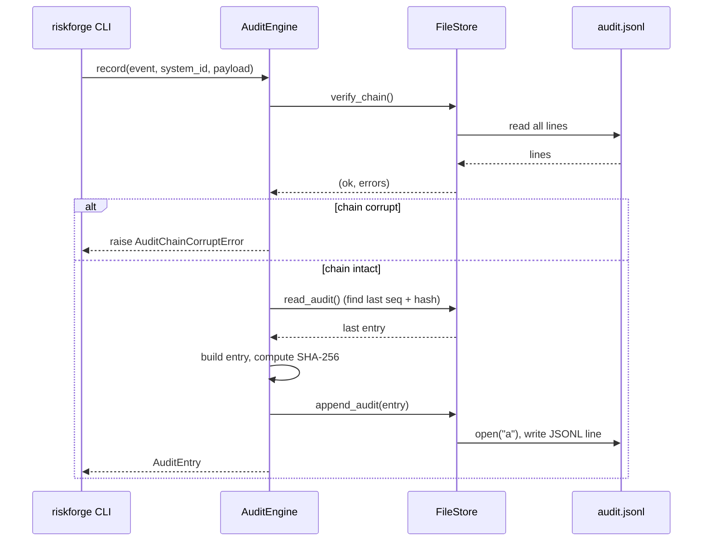

# Audit Chain Design

> Design notes, threat model, and evidentiary value of the SHA-256 hash-chained
> audit log (`audit.jsonl`) produced by RiskForge. Primary references:
> `src/riskforge/engine/audit.py`, `src/riskforge/storage/filesystem.py`
> (verify_chain, lines 380-445), `src/riskforge/models/audit.py`.
>
> Audience: security architects, security engineers, regulator's technical
> reviewers. Read this before relying on a RiskForge audit chain as evidence
> in a notified-body conformity dossier.

---

## 1. Why an audit chain at all

EU AI Act **Article 12** (Record-keeping) requires high-risk AI systems to
"technically allow for the automatic recording of events (logs)" over the
lifetime of the system. **Annex IV(2)(g)** requires the technical documentation
to describe the risk management system per Article 9. Together, they create a
demand for *traceable, tamper-evident evidence* that a particular risk
assessment was made by a particular person at a particular time, and that
nothing was retroactively altered to make the system look more compliant than
it was.

A naïve approach — append rows to a YAML file, commit to git — gets you
chronology but not tamper-evidence inside the running deployment. Anyone with
write access can rewrite history before the next commit. A regulator who is
handed a `.riskforge/` tree at month 14 has no way to tell whether seq=42 was
written on day 14 or day 138 with the timestamp lied about.

A SHA-256 hash chain is a small structural addition that closes that gap
**without** requiring the regulator to trust the deployer or RiskForge. Each
entry references the cryptographic hash of the previous entry; flipping any
byte anywhere in the file breaks the chain at every subsequent entry. The
verifier needs nothing other than the file itself and the SHA-256 algorithm.

This is a deliberately modest cryptographic primitive. It is not a digital
signature, not a Merkle tree with public anchors, not a blockchain. It is the
right level for the threat we are addressing — see §3.

---

## 2. Design

### 2.1 File format

The audit log is `audit.jsonl` inside the project's `.riskforge/` directory.
JSONL: one JSON object per line, UTF-8 encoded, newline-terminated. The file
is created with mode `0600` and the parent directory with `0700` —
`src/riskforge/storage/filesystem.py:322-336`. Permissions are reapplied on
every append, defending against `chmod` drift.

A canonical line looks like this (formatted for legibility; on disk it is one
line):

```json
{
  "seq": 0,
  "event": "system.created",
  "timestamp": "2026-05-10T14:22:01.123456+00:00",
  "actor": {"type": "human", "identity": "alice@example.com"},
  "system_id": "9f8b1c2d-...-...",
  "payload": {"name": "ExampleScreener", "version": "1.0"},
  "prev_hash": "0000000000",
  "entry_hash": "9c4f...e2b1"
}
```

Field semantics live in `src/riskforge/models/audit.py`:

- `seq: int` — monotonically increasing from `0`. Gaps fail verification.
- `event: str` — opaque string naming the state mutation
  (`system.created`, `register.updated`, `risk.added`, `rmf.exported`, …).
- `timestamp: datetime` — UTC, ISO-8601 with microseconds, set at record
  time by the engine — see `AuditEngine.record` at
  `src/riskforge/engine/audit.py:54`.
- `actor: AuditActor` — `{type: "human" | "ci" | "api", identity: str}`.
  The identity is an email, CI job name, or API key fingerprint — set at
  engine construction (`AuditEngine.__init__` at
  `src/riskforge/engine/audit.py:25-27`).
- `system_id: str` — the UUID string of the AI system the event relates to,
  or `""` for project-level events.
- `payload: dict` — event-specific structured data. Free-form by design;
  the contract is "human-readable enough to explain the event in a regulator
  conversation."
- `prev_hash: str` — the `entry_hash` of the previous entry. For the
  genesis entry (`seq=0`) the value is `"0000000000"` (ten zeros) — see §2.3.
- `entry_hash: str` — `SHA-256(canonical_json({prev_hash, ...entry_with_entry_hash_set_to_empty_string}))`.

### 2.2 Append-only contract

Every state mutation in RiskForge that touches the project tree must go
through `AuditEngine.record()`. The engine:

1. Calls `storage.verify_chain()` first, **before** writing
   (`src/riskforge/engine/audit.py:43`). If the existing chain is corrupt, a
   new entry is *not* appended — `AuditChainCorruptError` is raised with the
   list of violations. This is "fail loud" by design: silently appending a
   new entry on top of a corrupted chain would camouflage tampering.
2. Computes `seq = (last_entry.seq) + 1`, or `0` if the file is empty
   (`_next_seq` at `src/riskforge/engine/audit.py:35-39`).
3. Computes `prev_hash = last_entry.entry_hash`, or `"0000000000"` if the
   file is empty (`_last_entry_hash` at
   `src/riskforge/engine/audit.py:29-33`).
4. Builds the entry, computes `entry_hash`, and appends a single line.

The line is opened in append mode (`"a"`) on every write —
`src/riskforge/storage/filesystem.py:332`. There is **no** in-process file
lock and **no** OS-level file lock. Concurrent processes writing to the same
audit log will race. This is documented as a current limitation and assumes
the canonical use case: a single CLI process per project at a time.

### 2.3 Genesis entry handling

The genesis entry (`seq=0`) has no predecessor. Its `prev_hash` is set to
the literal string `"0000000000"` (ten zero ASCII characters). This is a
sentinel chosen for two properties: (a) it is not a valid SHA-256 hex digest
(which is 64 characters), so it cannot collide with a real prev_hash; (b)
it is a constant that both writer and verifier can hard-code without
ambiguity.

**Why genesis is special — historical bug.** Three audit-chain bugs were
fixed in v0.1.1 (CHANGELOG lines 92-103). One of them was a genesis-handling
mismatch: `AuditEngine` initialised genesis with one sentinel value; the
file-store `verify_chain` reconstructed it with a different one. Both worked
in isolation; but a chain written by the engine failed verification by the
store. The fix aligned both ends on `"0000000000"`. The relevant code lines
today:

- `AuditEngine._last_entry_hash` returns `"0000000000"` when the file is
  empty — `src/riskforge/engine/audit.py:29-33`.
- `FileStore.verify_chain` initialises `prev_hash = "0000000000"` before
  the loop — `src/riskforge/storage/filesystem.py:399`.

The comment on line 399 of `filesystem.py` explicitly notes: *"genesis value
— must match AuditEngine._last_entry_hash"*. Two call sites, one constant,
one comment connecting them. If you ever change one, change the other and
the test in the same commit. There is a regression test specifically for
this in the v0.1.1 test additions.

The same release also fixed two related bugs:

- `read_audit` was a coroutine returning a list; rewritten as a true async
  generator. This matters for `verify_chain` and `_last_entry_hash` because
  both iterate.
- `_compute_hash` now consistently sets `entry_hash=""` on the dict before
  hashing, instead of `pop`ping the key. `pop` would mutate the entry
  during hashing and produce different hashes on re-hash; the `=""`
  approach is idempotent. See `_compute_hash` at
  `src/riskforge/engine/audit.py:65-72`.

### 2.4 Canonical JSON for hashing

The hash is computed over a canonical JSON serialisation of the entry. The
implementation at `src/riskforge/engine/audit.py:65-72`:

```python
@staticmethod
def _compute_hash(prev_hash: str, entry: AuditEntry) -> str:
    data = entry.model_dump(mode="json")
    data["entry_hash"] = ""
    canonical = json.dumps(
        {"prev_hash": prev_hash, **data}, sort_keys=True, separators=(",", ":")
    )
    return hashlib.sha256(canonical.encode()).hexdigest()
```

Properties of the canonicalisation:

- `entry_hash` is replaced with `""` before hashing (otherwise the hash would
  cover itself, making it self-referential and impossible to compute).
- `prev_hash` is **prepended** as a separate top-level key — not just read
  from the entry — so the hash explicitly covers the chain link.
- `sort_keys=True` ensures deterministic ordering across Python versions and
  platforms.
- `separators=(",", ":")` strips whitespace, eliminating
  formatting-dependent hash drift.
- Pydantic's `model_dump(mode="json")` handles datetime → ISO-8601 string
  and UUID → string conversions deterministically.

This is *not* a JCS (RFC 8785) implementation. The format is sufficient for
internal verification but is not interoperable with non-Python verifiers
that expect JCS exactly. The verification recipe in §5 uses only this same
algorithm.

### 2.5 The `riskforge verify` command

`riskforge verify` re-reads `audit.jsonl` and replays the chain
(`FileStore.verify_chain` at
`src/riskforge/storage/filesystem.py:380-445`). The replay:

1. Reads the file line by line.
2. Tracks `expected_seq` (starting at 0) and `prev_hash` (starting at
   `"0000000000"`).
3. For each entry: validates JSON, validates the Pydantic model, checks
   `entry.seq == expected_seq`, checks `entry.prev_hash == prev_hash`,
   recomputes `entry_hash` via `_compute_hash` and checks equality with
   the stored value.
4. Does **not** stop on first error — it reports *all* violations, so
   one verification run gives you the full picture rather than a bisect
   chase.

**Exit codes (CI-detectable contract).**

- `0` — chain intact.
- `2` — chain corrupt. CI runners can pin `riskforge verify` as a
  required check; any tamper attempt bursts CI.

The `2` exit code is documented in the v0.1.0 release notes (CHANGELOG
line 131) and in the `AuditEngine` class docstring at
`src/riskforge/engine/audit.py:18-23`. Treat it as a stable contract;
downstream CI runners depend on it.



---

## 3. Threat model

This is the section that decides whether the audit chain is useful to your
organisation. Be honest with yourself before borrowing the chain as
evidence.

### 3.1 What the chain protects against

| Threat | Protection mechanism | Detection method |
| --- | --- | --- |
| Silent edit of a previously-written entry (e.g. backdating an acceptance) | `entry_hash` covers the entry's contents; recomputation will mismatch | `riskforge verify` exits 2; the offending line and field are listed |
| Insertion of a fabricated entry between two real entries | Inserted entry's `prev_hash` cannot match the preceding entry's `entry_hash` AND the next real entry's `prev_hash` cannot match the inserted entry's `entry_hash` | `riskforge verify` reports prev_hash mismatches at both ends |
| Deletion of an entry | `seq` gap is detected (`expected_seq` mismatch) and subsequent `prev_hash` values mismatch | `riskforge verify` reports both "sequence gap" and "prev_hash mismatch" |
| Re-ordering of entries | `prev_hash` linkage and `seq` ordering both break | `riskforge verify` reports both classes |
| Corruption from disk error / partial write | JSON parse error or hash mismatch | `riskforge verify` reports parse error or recompute mismatch |

The chain provides chronological integrity of the file. That is its
contract.

### 3.2 What the chain does NOT protect against

This list is longer than the previous one and that is the correct ratio.
The contrarian-challenger panel from the audit (Domain Expert persona)
specifically flagged the conflation of "the audit chain is intact" with
"the assessment is sound." They are different claims; only the first is
machine-checkable.

| Out-of-scope threat | Why the chain doesn't help | Mitigation lives elsewhere |
| --- | --- | --- |
| The assessment does not reflect the deployed system. The chain is intact, but the assessor described last year's model. | The chain attests *that* an entry was written and not subsequently altered — not *whether* the entry's claims about the AI system are true. | Provider's QMS; notified-body verification; customer due diligence |
| The assessor was not competent to make the judgements recorded. | The chain records who wrote (G6 captures identity) but not whether they were qualified. | HR competency framework; ISO/IEC 42001 Clause 7.2; Article 4 (AI literacy) controls |
| The residual-risk acceptance was unreasonable. | Acceptance is recorded; reasonableness is a human judgement. | Independent review; notified body |
| Two parties collude — assessor records what verifier wants to see. | An intact chain is consistent with a colluded narrative. The chain does not provide attestation by an independent third party. | Independent audit; multi-party signing (roadmap, see §6) |
| The host filesystem was compromised before any entry was written. | If the attacker controls writes from `seq=0`, they construct a fully valid chain that is internally consistent. The chain cannot detect a self-consistent forgery built from the start. | Build provenance attestation; signed snapshots to a third-party WORM store (roadmap) |
| The whole `.riskforge/` directory is replaced with a different one. | Both directories may verify cleanly. There is no project-level fingerprint anchored externally. | Anchor a `riskforge.yaml` fingerprint in a third-party log (roadmap) |
| Truncation of the tail (delete the last *N* entries). | Truncating the tail leaves a *prefix* that verifies cleanly. Without an external anchor of "the latest known seq", the verifier cannot tell. | External anchor (Sigstore Rekor / git tag, roadmap §6) |
| Timestamp is wrong (clock-skew or deliberate). | Timestamps are written by the local engine using the local clock. The chain enforces *order* via `seq`, not wall-clock truthfulness. | Trusted timestamping (RFC 3161 / Sigstore Rekor inclusion proofs, roadmap) |
| The signing identity is impersonated. | RiskForge does **not** currently sign audit entries with a private key. The `actor.identity` field is a self-attestation, no different from typing a name into a form. | Signed entries (roadmap §6) |

**The honest summary.** The chain is a tamper-evidence layer for a single
file in a single project on a single machine. It is not a substitute for
independent attestation, signed identity, or external time-stamping. We
would rather you understand this on day 1 than be surprised by a notified
body on day 90.

---

## 4. Evidentiary value to a notified body

What kinds of audit-chain claims survive a 15-minute conversation with a
notified body (BSI, TÜV SÜD, DEKRA, etc.)? Framed pragmatically:

**Likely accepted.**

- *"This is the recorded history of the assessment. The chain verifies; no
  silent edits."* — Defensible. The reviewer can run `riskforge verify`
  themselves and reproduce the result.
- *"Each event is attributed to a recorded actor (G6 enforces this for the
  RMF)."* — Defensible, with the caveat that actor identity is
  self-attested; it is no weaker than the rest of the technical
  documentation, which is also self-attested by the provider.
- *"The exported RMF is one input to your conformity assessment, alongside
  the rest of the Annex IV pack."* — This is the correct framing.

**Likely pushed back on.**

- *"The audit chain proves the assessment is correct."* — No. It proves
  the file has not been edited since each entry was written. Different
  claim.
- *"The audit chain provides cryptographic non-repudiation."* — No, not
  currently. Non-repudiation requires a signing identity. Without signing
  (roadmap §6), the chain is tamper-evident, not non-repudiable.
- *"This replaces the need for an independent third-party attestation."*
  — No, see §3.2.

**Almost certainly probed.**

- *"How do we know the entries weren't all written yesterday with backdated
  timestamps before you handed us the directory?"* — The honest answer:
  with the current design, you cannot tell from the file alone. Either
  the deployer commits to git and you anchor on commit timestamps, or you
  wait for the v1.x Sigstore inclusion proofs (roadmap §6).
- *"What stops a developer from running `rm audit.jsonl` and starting
  fresh?"* — Nothing in the tool. The `.nodelete` sentinel
  (`src/riskforge/storage/filesystem.py:13-22`) is a *footgun guard*
  against accidental `rm -rf`, not a malicious-actor control. Operational
  controls (filesystem permissions, git pre-commit hooks, off-host backup)
  must do that work.

The right framing is: RiskForge produces *one* of several evidentiary
artefacts the notified body will examine. It is the artefact that
specifically demonstrates the Article 9 risk-management process was run
and documented. It is not the artefact that demonstrates the system is
safe, fair, robust, or transparent — those are demonstrated by the
underlying engineering evidence the RMF *points at*.

---

## 5. Verification recipe

Exact commands a regulator (or a paranoid deployer) would run to validate
a submitted RMF + `audit.jsonl` pair.

### 5.1 Full automated verification

Inside an isolated environment (conda env or Docker — RiskForge installs
must not pollute the host; see project conventions):

```bash
# Receive the project tree from the provider
unzip provider-submission.zip -d submission/
cd submission/

# Install RiskForge in an isolated env
python -m venv .venv && source .venv/bin/activate
pip install riskforge

# Run the verifier
riskforge verify
echo "Exit code: $?"   # 0 = chain intact; 2 = corrupt
```

If the chain verifies, the next step is to verify the **content** matches
the exported RMF.

### 5.2 Manual hash spot-check

For one entry, reproduce the hash by hand to satisfy yourself the algorithm
is what it claims to be. The canonical algorithm:

```python
import hashlib, json
from pathlib import Path

lines = Path(".riskforge/audit.jsonl").read_text().splitlines()
prev_hash = "0000000000"
for i, line in enumerate(lines):
    entry = json.loads(line)
    stored_hash = entry["entry_hash"]
    entry_for_hash = dict(entry)
    entry_for_hash["entry_hash"] = ""
    canonical = json.dumps(
        {"prev_hash": prev_hash, **entry_for_hash},
        sort_keys=True, separators=(",", ":")
    )
    computed = hashlib.sha256(canonical.encode()).hexdigest()
    assert computed == stored_hash, f"Mismatch at seq={entry['seq']}"
    assert entry["prev_hash"] == prev_hash, f"prev_hash mismatch at seq={entry['seq']}"
    prev_hash = stored_hash
print(f"Verified {len(lines)} entries.")
```

If this script and `riskforge verify` agree on the result, the verification
is robust against a tampered RiskForge binary — the script depends only
on the Python standard library.

### 5.3 Cross-check against the RMF export

The exported RMF (`json` or `pdf`) is generated by an `rmf.exported`
audit event. Find that event in `audit.jsonl`:

```bash
grep '"event":"rmf.exported"' .riskforge/audit.jsonl | tail -n 1
```

The payload should contain a hash or reference to the export artefact.
Compare to the SHA-256 of the file you were handed:

```bash
sha256sum exports/<export_id>.json
```

If the hashes diverge, the RMF you were handed is not the one whose
export was recorded.

### 5.4 Reasonableness checks (human, not algorithmic)

These are the checks the chain *cannot* do for you:

- Is the assessor identity (`actor.identity`) plausible? Does the email
  domain match the provider's domain?
- Are timestamps in chronological order *and* paced realistically? An RMF
  with 80 entries written within 90 seconds is suspicious — even if the
  chain verifies.
- Does the `system_id` match the AI system you are actually evaluating?
- Are there long gaps suggesting the deployer abandoned the assessment
  for months and then resumed?
- Are events that should appear (e.g. `register.updated` events between a
  significant model retrain and the next RMF export) actually present?

These are interview questions for the provider, not algorithm outputs.

---

## 6. Roadmap

Each item below is **planned**, not current. Do not rely on these in any
evidentiary claim until the corresponding feature ships.

### 6.1 Sigstore signing of audit entries (PRD NFR-4)

**Goal.** Convert the chain from tamper-evident to non-repudiable. Each
audit entry would be co-signed by a Sigstore-issued ephemeral key bound to
the actor's OIDC identity (Google Workspace, GitHub, etc.), with the
signature published to the Rekor transparency log.

**What this would unlock.**

- Notified-body conversation: *"The actor identity on each entry is bound
  to a verified OIDC token at the time of signing, recorded in a public
  transparency log. You can verify it without trusting RiskForge or the
  deployer."*
- External anchoring: Rekor inclusion proofs give a third-party
  timestamp, defeating the backdating threat in §3.2.

**Reference.** PRD NFR-4 (RiskForge product spec). Sigstore is already
used for **release** signing (CHANGELOG line 134: *"Sigstore OIDC signing
on all PyPI releases"*). Extending the same identity model to runtime
audit entries is the planned move.

### 6.2 Key custody story

The current design has no private keys to custody — actor identity is
self-attested. Once §6.1 lands, key custody becomes:

- **Default (recommended).** Sigstore ephemeral keys. No long-lived key
  material on the deployer's machine. Identity proven via OIDC at sign
  time; key destroyed after.
- **Air-gapped fallback.** For deployers whose Article 9 process runs in
  air-gapped environments, a hardware-backed signing key (YubiKey or
  equivalent) with a local attestation record. Trades transparency-log
  anchoring for offline operation.

Either path requires a documented operational runbook before release. The
runbook does not exist yet.

### 6.3 Key rotation procedure

Once signing is enabled, key rotation will be needed for:

- Personnel changes (assessor leaves the organisation).
- Compromise of the OIDC identity provider for the relevant tenant.
- Routine rotation cadence (recommendation: align with the provider's
  existing certificate-management policy).

The chain itself does not break across a key-rotation boundary because the
hash linkage is independent of identity. What changes is the verifier's
willingness to accept an entry signed under the new key — that requires a
rotation event recorded in-chain, plus updated key trust policy at the
verifier.

This procedure will be documented in `docs/operations/key-rotation.md`
**when** signing ships. Until then, the question does not arise.

### 6.4 External anchoring without signing

A simpler intermediate step: periodically commit the SHA-256 of the
*latest* `entry_hash` to a public timestamping service (RFC 3161 TSA, or
Rekor without a key). This defeats the truncation threat (§3.2 — "delete
the last N entries") at much lower implementation cost than full signing.
Status: design discussion only.

---

## 7. Summary

- Append-only JSONL with SHA-256 prev-hash linkage. Genesis sentinel:
  `"0000000000"`.
- `riskforge verify` exits `0` on intact, `2` on corrupt — CI-detectable.
- Detects edit, insertion, deletion, reorder, corruption.
- Does **not** prove the assessment is sound, the assessor was competent,
  the residual-risk acceptance was reasonable, or the recorded identity
  is real. Those are different claims requiring different controls.
- Three v0.1.1 bugs (genesis mismatch, async-generator, hash idempotence)
  are fixed and pinned by regression tests; if you change the genesis
  sentinel or the canonical-JSON algorithm, change both call sites and
  the test in the same commit.
- Sigstore signing, key custody, key rotation, and external anchoring are
  **roadmap** — not current capabilities.

If you find a discrepancy between this document and the source of truth
(`src/riskforge/engine/audit.py`, `src/riskforge/storage/filesystem.py`),
the source of truth wins and this document needs a patch. File an issue at
<https://github.com/aiexponenthq/riskforge/issues>.

Last verified against the codebase on **2026-05-10**.
